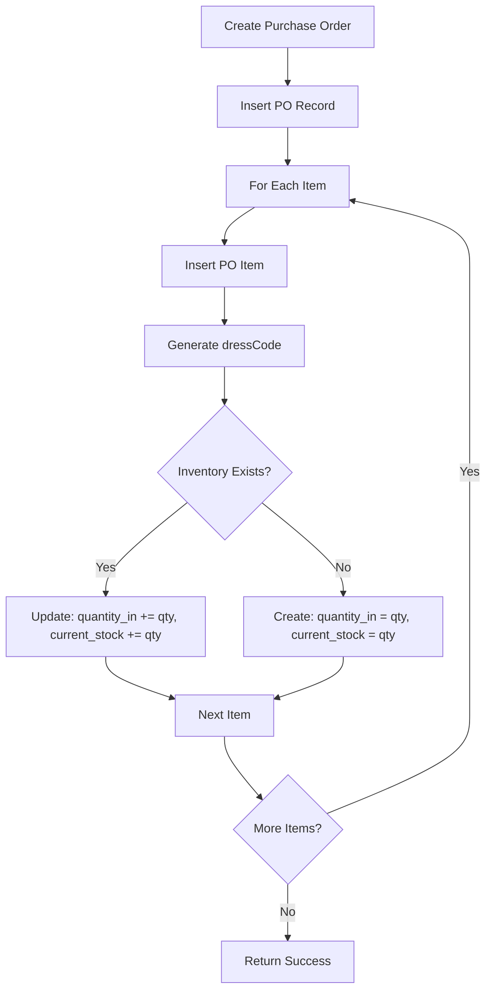
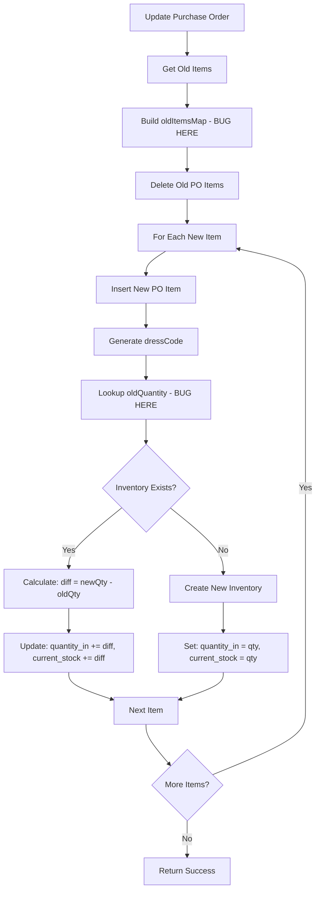

# Inventory Stock Issue - Detailed Analysis

## Executive Summary

When purchase order quantities are added or updated, the inventory stock (`quantity_in`, `quantity_out`, and `current_stock`) is not reflecting correctly. This document provides a comprehensive analysis of the root causes and proposed solutions.

---

## Problem Statement

**Issue**: When adding or updating quantities in purchase orders, the inventory stock values (`quantity_in` and `current_stock`) are not updating correctly, causing discrepancies in in/out stock tracking.

**Impact**: 
- Inventory levels are inaccurate
- Stock tracking is unreliable
- Business decisions based on stock levels may be incorrect

---

## Root Cause Analysis

### 1. Critical Bug in Purchase Order Update (PUT) - `app/api/purchases/[id]/route.ts`

#### Location: Lines 96-105

**The Problem:**
```typescript
// Get old quantities BEFORE deleting items
const oldItemsResult = await query(
  'SELECT product_name, quantity FROM purchase_order_items WHERE purchase_order_id = $1',
  [id]
)
const oldItemsMap = new Map<string, number>()
oldItemsResult.rows.forEach((row: any) => {
  const key = `${row.product_name}_${body.items?.find((i: any) => i.productName === row.product_name)?.fabricType || 'standard'}`
  oldItemsMap.set(key, (oldItemsMap.get(key) || 0) + parseInt(row.quantity))
})
```

**Issues Identified:**

1. **Missing `fabric_type` in SELECT query (Line 98)**
   - The query only selects `product_name` and `quantity`
   - It does NOT select `fabric_type` from the database
   - This means we lose the original fabric type information

2. **Incorrect Key Generation (Line 103)**
   - The code tries to find `fabricType` from the NEW items array (`body.items?.find(...)`)
   - This is fundamentally wrong because:
     - The old item's fabric type might be different from the new item's fabric type
     - If the product name doesn't exist in the new items, it defaults to `'standard'`
     - Multiple old items with the same product name but different fabric types will be incorrectly aggregated

3. **Key Mismatch (Line 158)**
   - When calculating the difference, it uses `dressCode` to look up in `oldItemsMap`
   - But `dressCode` is generated from the NEW item: `${item.productName}_${item.fabricType || 'standard'}`
   - The key in `oldItemsMap` was generated using the NEW item's fabricType (or default), not the OLD item's fabricType
   - This causes the lookup to fail or return incorrect values

**Example Scenario:**
```
Old Purchase Order Item:
  - product_name: "Kurti Pink"
  - fabric_type: "Cotton"
  - quantity: 10

New Purchase Order Item:
  - productName: "Kurti Pink"
  - fabricType: "Silk"  (changed!)
  - quantity: 15

What happens:
1. oldItemsMap key = "Kurti Pink_Silk" (WRONG - uses new fabricType)
2. dressCode = "KURTI_PINK_SILK" (from new item)
3. oldQuantity = oldItemsMap.get("KURTI_PINK_SILK") = 0 (because key doesn't match)
4. quantityDifference = 15 - 0 = 15 (WRONG - should be 15 - 10 = 5)
5. Stock increases by 15 instead of 5!
```

---

### 2. Inventory Matching Logic Issues

#### Location: `app/api/purchases/route.ts` (POST) and `app/api/purchases/[id]/route.ts` (PUT)

**The Problem:**
The inventory matching uses a generated `dressCode` that may not match existing inventory items:

```typescript
const dressCode = `${item.productName}_${item.fabricType || 'standard'}`.replace(/\s+/g, '_').toUpperCase()
```

**Issues:**

1. **Case Sensitivity and Normalization**
   - The dress code generation normalizes spaces to underscores and converts to uppercase
   - But existing inventory items might have been created with different normalization
   - Example: "Kurti Pink" vs "Kurti  Pink" (double space) will generate different codes

2. **Fabric Type Handling**
   - If `fabricType` is `null` or `undefined`, it defaults to `'standard'`
   - But existing inventory might have been created with `fabric_type = null` (not 'standard')
   - This causes mismatches

3. **Fuzzy Matching Fallback**
   - The fuzzy matching (lines 262-269 in POST, 140-147 in PUT) uses:
     - `LOWER(TRIM(dress_name)) = LOWER(TRIM($1))` - exact name match
     - `LOWER(dress_code) LIKE LOWER($2)` - partial code match
   - This can match the wrong inventory item if multiple items have similar names
   - No validation that the matched item is actually the correct one

---

### 3. Race Condition in Stock Updates

#### Location: Both POST and PUT endpoints

**The Problem:**
Stock updates happen in a loop without transaction isolation:

```typescript
for (const item of items) {
  // Insert purchase order item
  await query(...)
  
  // Update inventory stock
  await query(...)
}
```

**Issues:**

1. **No Transaction Wrapping**
   - If an error occurs mid-loop, some items are updated but others are not
   - This leaves the system in an inconsistent state

2. **Concurrent Updates**
   - If two purchase orders are created simultaneously for the same product
   - Both might read the same `current_stock` value
   - Both calculate new stock based on the same base value
   - One update overwrites the other, losing one of the updates

3. **No Locking Mechanism**
   - No row-level locking on inventory items
   - Multiple concurrent requests can cause lost updates

---

### 4. Stock Calculation Formula Issues

#### Current Formula:
```typescript
// For new purchases (POST)
newQuantityIn = currentQuantityIn + purchaseQuantity
newCurrentStock = currentStock + purchaseQuantity

// For updates (PUT)
quantityDifference = newPurchaseQuantity - oldQuantity
newQuantityIn = currentQuantityIn + quantityDifference
newCurrentStock = currentStock + quantityDifference
```

**Issues:**

1. **No Validation of Old Quantity**
   - In PUT, if `oldQuantity` is 0 (due to key mismatch), the entire new quantity is added
   - This can cause stock to inflate incorrectly

2. **No Handling of Deleted Items**
   - When updating a purchase order, if an item is removed, the stock should decrease
   - But the current logic only processes items in the new array
   - Deleted items are not accounted for

3. **Multiple Items with Same Product**
   - If a purchase order has multiple items with the same product name but different fabric types
   - The oldItemsMap aggregation (line 104) might incorrectly sum quantities
   - This is especially problematic if the key generation is wrong

---

## Data Flow Analysis

### Current Flow (POST - Create Purchase Order)



**Issues in POST Flow:**
- No transaction wrapping
- No validation of matching logic
- Fuzzy matching might select wrong item

### Current Flow (PUT - Update Purchase Order)



**Issues in PUT Flow:**
- Line 103: Wrong key generation (uses new item's fabricType)
- Line 98: Missing fabric_type in SELECT
- Line 158: Key mismatch between oldItemsMap and dressCode
- No handling of deleted items
- No transaction wrapping

---

## Impact Assessment

### High Impact Issues

1. **Stock Inflation**
   - When updating purchase orders, if the old quantity lookup fails (returns 0), the entire new quantity is added
   - This causes stock to increase incorrectly
   - Example: Update from 10 to 15, but old quantity not found → stock increases by 15 instead of 5

2. **Stock Deflation**
   - If an item is removed from a purchase order during update, its quantity is not subtracted
   - Stock remains inflated

3. **Wrong Inventory Item Updates**
   - Fuzzy matching might update the wrong inventory item
   - This causes stock to be in the wrong place

### Medium Impact Issues

1. **Concurrent Update Loss**
   - Race conditions can cause lost updates
   - Less frequent but still problematic

2. **Data Inconsistency**
   - No transactions mean partial updates can occur
   - System can be left in inconsistent state

---

## Proposed Solutions

### Solution 1: Fix Purchase Order Update Logic (CRITICAL)

**File**: `app/api/purchases/[id]/route.ts`

**Changes Required:**

1. **Fix SELECT query to include fabric_type:**
```typescript
const oldItemsResult = await query(
  'SELECT product_name, fabric_type, quantity FROM purchase_order_items WHERE purchase_order_id = $1',
  [id]
)
```

2. **Fix key generation to use old item's fabric_type:**
```typescript
const oldItemsMap = new Map<string, number>()
oldItemsResult.rows.forEach((row: any) => {
  const oldFabricType = row.fabric_type || 'standard'
  const key = `${row.product_name}_${oldFabricType}`.replace(/\s+/g, '_').toUpperCase()
  oldItemsMap.set(key, (oldItemsMap.get(key) || 0) + parseInt(row.quantity))
})
```

3. **Handle deleted items:**
   - After processing all new items, check if any old items were not in the new items
   - Subtract their quantities from inventory

4. **Add transaction wrapping:**
```typescript
await query('BEGIN')
try {
  // ... all update logic ...
  await query('COMMIT')
} catch (error) {
  await query('ROLLBACK')
  throw error
}
```

### Solution 2: Improve Inventory Matching Logic

**Files**: `app/api/purchases/route.ts`, `app/api/purchases/[id]/route.ts`

**Changes Required:**

1. **Normalize dress code generation consistently:**
```typescript
function generateDressCode(productName: string, fabricType: string | null): string {
  const normalizedName = productName.trim().replace(/\s+/g, '_').toUpperCase()
  const normalizedFabric = (fabricType || 'standard').trim().replace(/\s+/g, '_').toUpperCase()
  return `${normalizedName}_${normalizedFabric}`
}
```

2. **Improve fuzzy matching with validation:**
   - After fuzzy match, validate that the match is reasonable
   - Add logging for fuzzy matches to track when they occur
   - Consider requiring manual confirmation for fuzzy matches

3. **Add inventory item linking:**
   - Store `inventory_id` in `purchase_order_items` table
   - This creates an explicit link instead of relying on matching logic
   - Reduces matching errors

### Solution 3: Add Transaction Support

**Files**: All purchase and sales API endpoints

**Changes Required:**

1. **Wrap all stock updates in transactions:**
```typescript
async function updateInventoryStock(item, quantityChange) {
  await query('BEGIN')
  try {
    // Lock inventory row
    await query('SELECT * FROM inventory WHERE id = $1 FOR UPDATE', [inventoryId])
    
    // Update stock
    await query('UPDATE inventory SET ...')
    
    await query('COMMIT')
  } catch (error) {
    await query('ROLLBACK')
    throw error
  }
}
```

2. **Use database-level locking:**
   - `SELECT ... FOR UPDATE` to lock inventory rows
   - Prevents concurrent updates

### Solution 4: Add Stock Reconciliation

**New File**: `scripts/reconcile-stock.js`

**Purpose:**
- Calculate expected stock from purchase orders and sales
- Compare with actual inventory stock
- Generate report of discrepancies
- Option to auto-fix or manual review

**Formula:**
```
Expected Stock = Sum of all purchase order quantities - Sum of all sale quantities
Actual Stock = current_stock from inventory table
Discrepancy = Expected Stock - Actual Stock
```

---

## Implementation Priority

### Phase 1: Critical Fixes (Immediate)
1. ✅ Fix purchase order update logic (Solution 1)
   - Fix SELECT query
   - Fix key generation
   - Add transaction support

### Phase 2: Stability Improvements (Short-term)
2. ✅ Improve inventory matching (Solution 2)
   - Normalize dress code generation
   - Add inventory_id linking

3. ✅ Add transaction support (Solution 3)
   - Wrap all updates in transactions
   - Add row-level locking

### Phase 3: Data Quality (Medium-term)
4. ✅ Add stock reconciliation (Solution 4)
   - Create reconciliation script
   - Generate discrepancy reports
   - Provide fix options

---

## Testing Strategy

### Unit Tests
- Test key generation with various fabric types
- Test old quantity lookup logic
- Test stock calculation formulas

### Integration Tests
- Test purchase order creation with existing inventory
- Test purchase order update scenarios:
  - Update quantity (increase)
  - Update quantity (decrease)
  - Change fabric type
  - Remove item
  - Add new item
- Test concurrent updates

### Manual Testing Scenarios
1. Create purchase order with new product → Verify stock created correctly
2. Create purchase order with existing product → Verify stock increased
3. Update purchase order quantity → Verify stock difference applied
4. Update purchase order fabric type → Verify old stock reversed, new stock added
5. Delete purchase order → Verify stock decreased
6. Create two purchase orders simultaneously → Verify no lost updates

---

## Risk Assessment

### Low Risk
- Fixing SELECT query (Solution 1.1)
- Normalizing dress code generation (Solution 2.1)

### Medium Risk
- Fixing key generation (Solution 1.2) - Need to test thoroughly
- Adding transactions (Solution 3) - Need to ensure no deadlocks

### High Risk
- Handling deleted items (Solution 1.3) - Complex logic, needs careful testing
- Stock reconciliation (Solution 4) - Might reveal large discrepancies

---

## Rollback Plan

1. **Before implementing:**
   - Backup database
   - Document current stock values
   - Create test purchase orders to verify behavior

2. **After implementing:**
   - Run stock reconciliation script
   - Compare before/after stock values
   - Verify purchase order updates work correctly

3. **If issues found:**
   - Revert code changes
   - Restore database backup if needed
   - Run reconciliation to identify and fix discrepancies

---

## Additional Recommendations

1. **Add Audit Logging**
   - Log all stock changes with timestamps
   - Track which purchase order/sale caused the change
   - Helps with debugging and reconciliation

2. **Add Stock Validation**
   - Prevent negative stock (already done for sales)
   - Add warnings for unusual stock changes
   - Alert on large discrepancies

3. **Improve Error Messages**
   - When inventory matching fails, provide clear error
   - Suggest manual inventory item creation
   - Log matching attempts for debugging

4. **Database Constraints**
   - Add check constraint: `current_stock >= 0`
   - Add check constraint: `quantity_in >= 0`, `quantity_out >= 0`
   - Add unique constraint on `dress_code` (if not already present)

---

## Additional Requirements

### Requirement 1: Supplier-Based Inventory Filtering

**Current State:**
- Inventory page has search functionality that includes supplier name
- No dedicated supplier filter dropdown
- No grouping by supplier

**Required Changes:**
1. Add supplier filter dropdown to inventory page (similar to purchase orders page)
2. Add supplier grouping view option
3. Update API to support supplier filtering
4. Display inventory grouped by supplier with expandable sections

**Implementation:**
- Add `supplierFilter` state to inventory page
- Fetch unique suppliers from inventory
- Add dropdown filter component
- Add grouping toggle/view option
- Update `/api/inventory` to accept `supplier` query parameter
- Group items by supplier in UI

### Requirement 2: Smart Stock Setting

**Current State:**
- Manual stock adjustments use `+In` and `-Out` buttons
- Stock setting logic needs to properly calculate `quantity_in` and `quantity_out`
- `current_stock` should always equal `quantity_in - quantity_out`

**Required Changes:**
1. When setting `current_stock` directly, calculate `quantity_in` based on existing `quantity_out`
2. Formula: `quantity_in = current_stock + quantity_out`
3. Ensure all stock updates maintain the relationship: `current_stock = quantity_in - quantity_out`
4. Update stock adjustment API to handle smart calculations

**Implementation:**
- Update `/api/inventory/[id]/stock` endpoint
- Add validation: `current_stock = quantity_in - quantity_out`
- When setting stock, auto-calculate missing values
- Add audit logging for stock changes

---

## Conclusion

The primary issue is in the purchase order update logic where the old quantity lookup fails due to incorrect key generation. This causes stock to be incorrectly calculated when purchase orders are updated. The fix requires:

1. Including `fabric_type` in the old items query
2. Using the old item's fabric type (not the new item's) for key generation
3. Adding proper transaction support
4. Handling deleted items

**Additional requirements:**
5. Add supplier-based filtering and grouping to inventory page
6. Implement smart stock setting that maintains `current_stock = quantity_in - quantity_out` relationship

These fixes should resolve the stock tracking issues and ensure accurate inventory management with improved usability.
